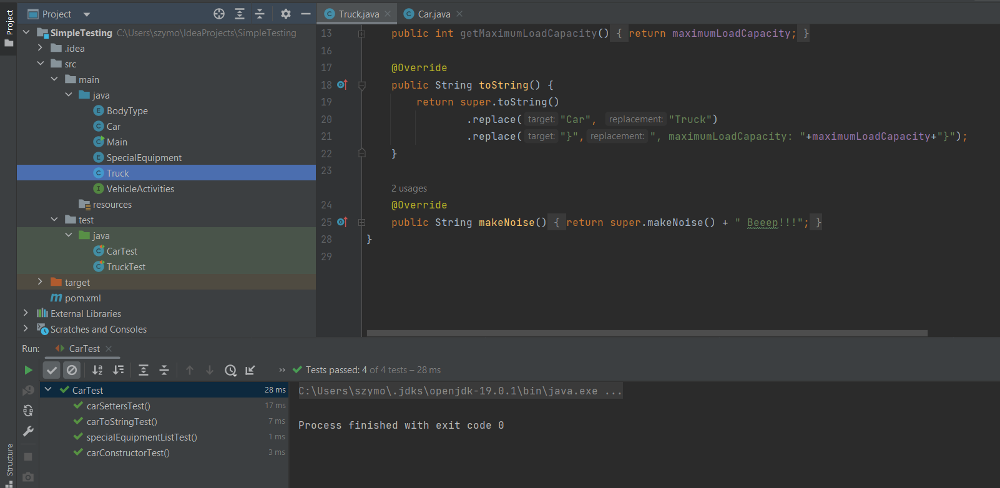
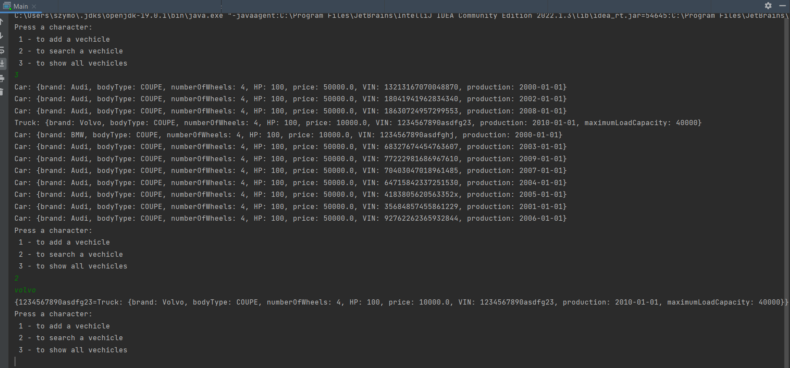

# Automotive Portal

### Technologies:

---

>Java, Maven, JUnit5, OOP  
 

### Brief description

---

This console program is a simple portal, which allows you to add your car to system with necessary information. Just like in the real portal, you can view all available cars with the following data:
* brand
* price
* VIN
* production year
* mileage  

Moreover, you can search for your desired car and view its complete details.  
Still there is lack of GUI and advanced options, but the project will be improved in the near future. 

If you added a GUI and improved this application slightly, you could use it in your small business, such as a small used car store. If you put in a little more time, you could implement such an application in an online store. It should works similary to popular platforms e.g. *ebay.com*, *serialnumberlookup.fender.com*
 
 

### How it was build?

---

Applied *Maven* management and simple *JUnit5* that tests basics features. 
 
 

Let's take a look how the program looks like from the programmer's site. Below you can see some pictures that may help you understand the project.

  
Img 1 - Code preview from the IDE *IntelliJ IDEA*  
 

  
Img 2 - Preview of the running program  

As you can see in the picture above, first we displayed all vechicles. The search engine was then selected to show a vehicle with a description containing the phrase *volvo*. You can see, the app returned the correct data.  
 
 
Now you can imagine how simple and convinient this application could be if you added a GUI. 

