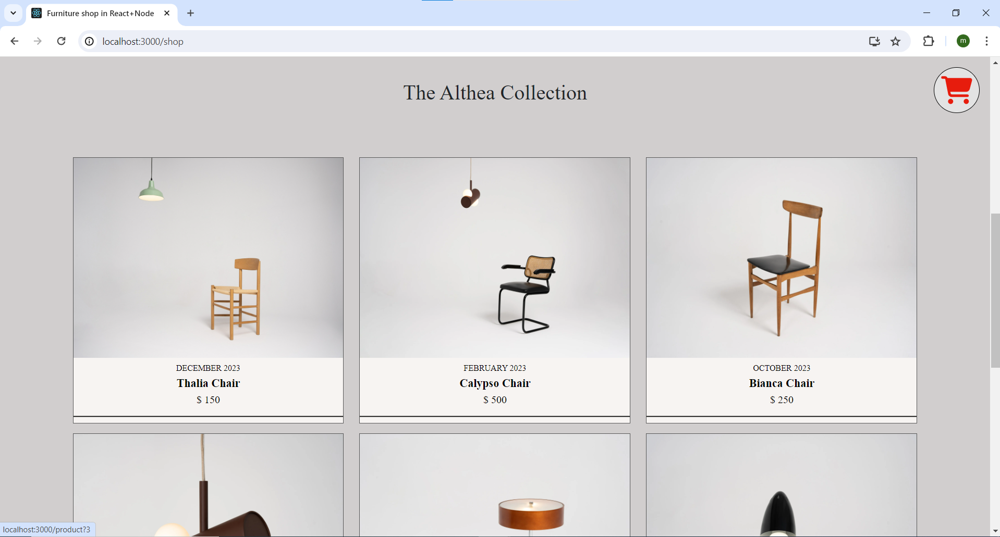
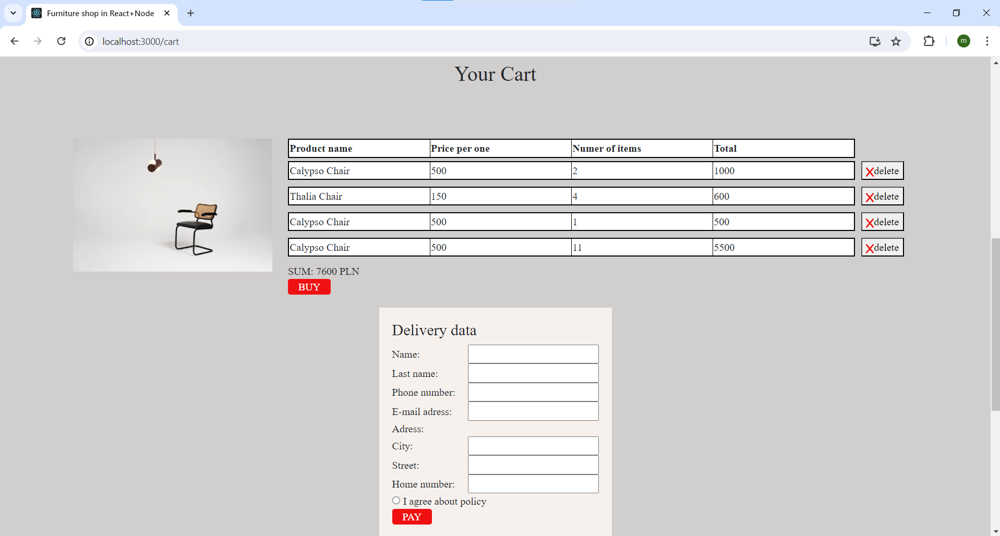

# Furniture Store

This project is based on `Node.js` + `React` technologies. Database - `MySql`.  

>Ports:  
`4000` - backend  
`3000` - frontend  

>Run app using *`startApp.bat`*  

>**Note:** You have to create the `node-modules` library in both folders - `backend` and `frontend`, <span style="color:red">if they don't exists</span>. Create such library by Command Line:  
1. First, navigate to the appropriate directory, e.g  
    ```bash
    cd C:\xampp\htdocs\Furniture Store - React+Node\backend
    ```
2. Install *express* library:
    ```bash
    npm install express
    ```
    Now you have created *node-modules* folder in your *backend* folder. If necessary, repeat both steps to the *frontend* folder.
    

### Brief description

---

This project is a simple example of an online store. There is no payment function here, but there is a virtual shopping *cart*. The layout is fully responsive, thus you can conveniently use this web application using various devices e.g. smartphone, tablet, laptop. The database works on real time mode, so you are up to date with available products.  

Let's take a look to several screenshots:  
<div style="text-align:center">

  
<em>Img 1 - List of products</em>
<br>

  
<em>Img 2 - Preview of the selected product</em>
<br>

  
<em>Img 3 - Preview of the selected product on smartphone</em>
<br>

  
<em>Img 4 - Cart preview</em>
<br>

  
<em>Img 5 - Cart preview - response from backend</em>
<br><br>

</div>

As you can see, this app works! You can see the exact product description and its availability. You can add and delete selected product from your cart. Moreover you can choose the number of pieces of the added product.