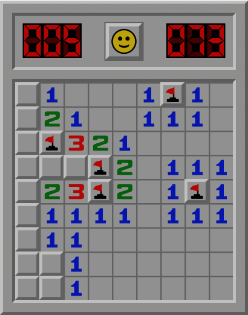
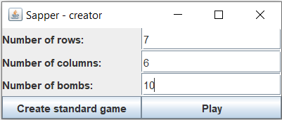
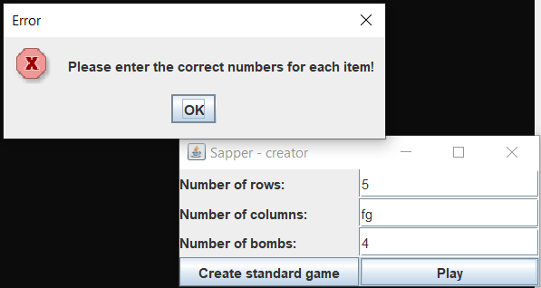
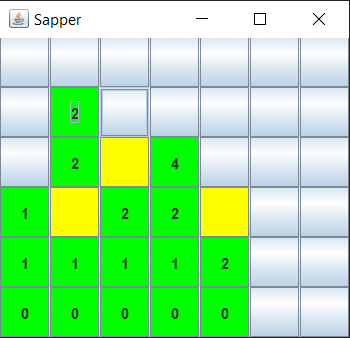
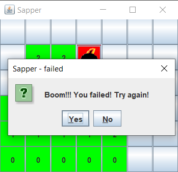

# Sapper

### Technologies

>Java, Maven, java Swing
   

### Brief description

---

*Sapper* is a classic game based on *Minesweeper* (article: https://en.wikipedia.org/wiki/Minesweeper_(video_game))  

### How it works?

---  

After starting the application, the game wizard appears. You can define the game parameters or choose the  predefined option.  
  
Img. 1. Game wizard  
   

If you initialize invalid parameters, an error message will appear.  
  
Img. 2. Error message  
   

Once you have started, you can mark the boxes in green (left click) or yellow (right click). The green boxes show the number of adjacent bombs.  
  
Img. 3. Game view  
   

When you hit the bomb, a failure message will appear. You can try again or quit the game.  
  
Img. 4. Failure preview  