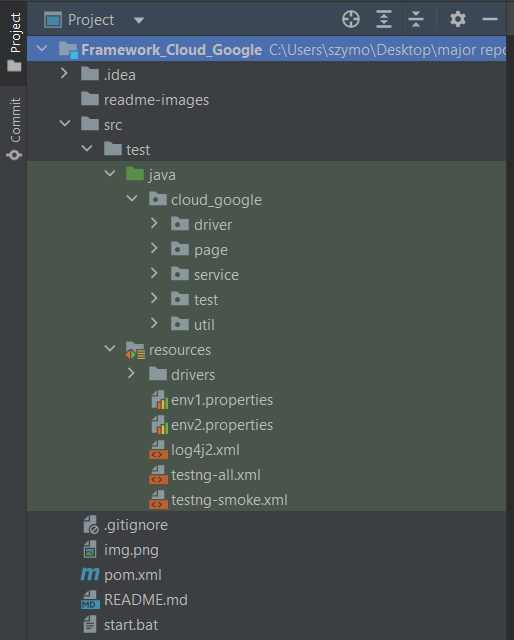
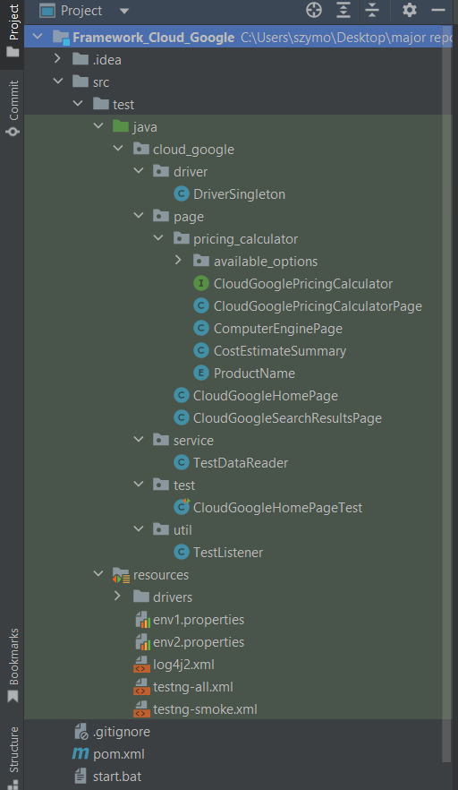
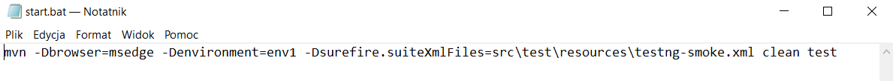
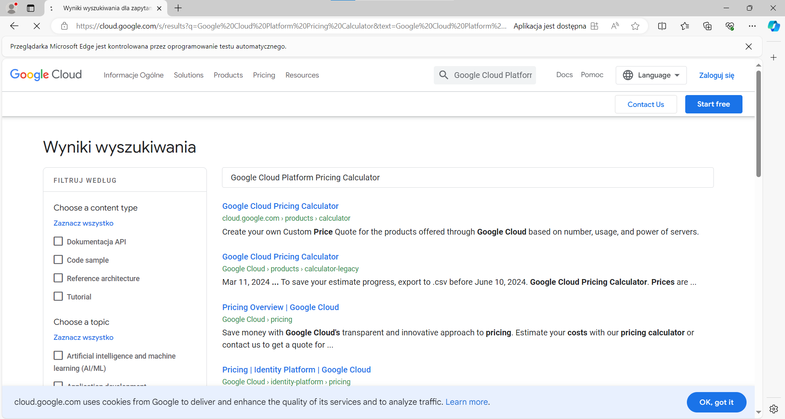
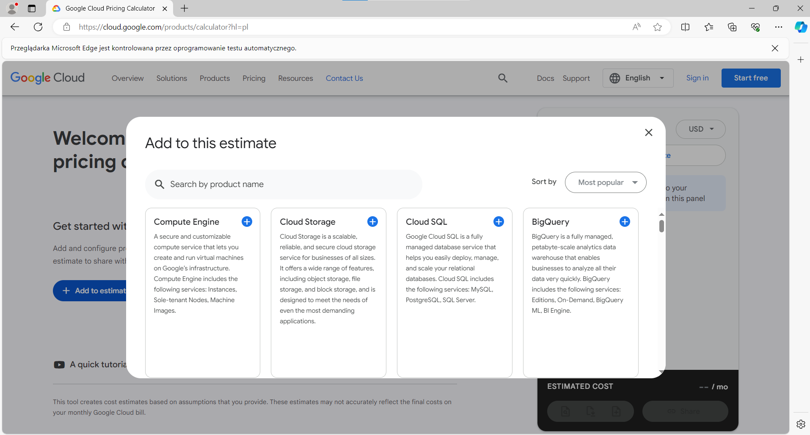
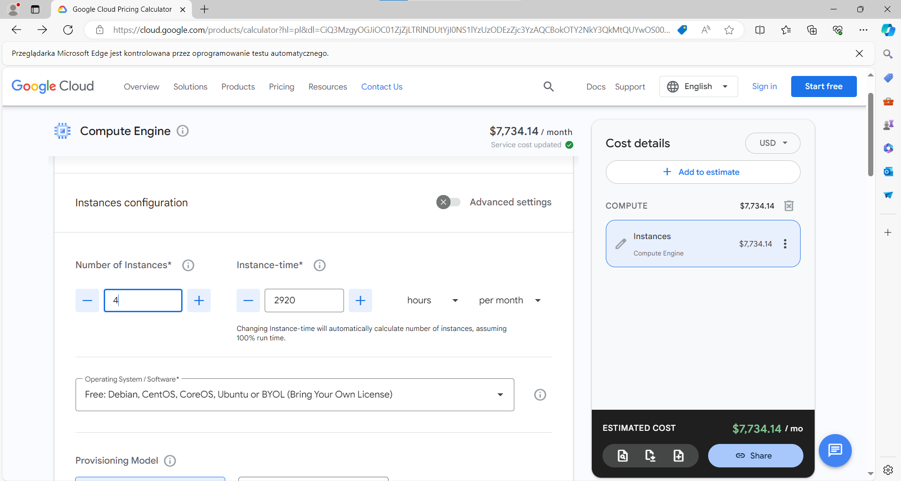
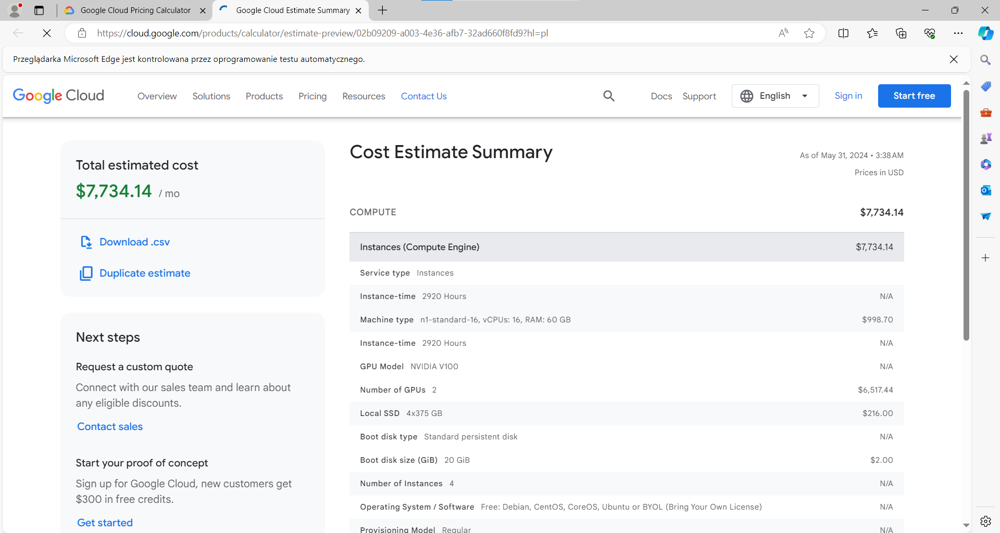

# Cloud Google - WebDriver framework

### Technologies

>`Java`, `Selenium WebDriver`, `JUnit`, `Maven`
   

### Brief description

---

This WebDriver allows you to estimate the costs of renting a virtual CPU via the https://cloud.google.com/ platform.  
The test involves trying to re-enter the *Cloud Google* page 5 times and fill out the form.  
The program launches the website https://cloud.google.com/ in one go, then searches for a phrase, selects one result, accepts the agreements, fills out the form and finally sends it and displays the report.

### How it works?

---

#### Let's take a look at what it looks like from the programmer's point of view.  

   

  
Img 1, 2 - Project structure  

 

As you might see, first you have to create the Maven project and add appropriate dependencies. Next, you need to upload desired drivers into your project. In this situation, the drivers was located in `src/test/resources/drivers/`.  
The resource directory also contains a number of files that include: environment properties, specific test suites to run, and log format.  

   

"*browser*" and "*environment*" system properties needed to be set to be able to run the test.
  
Img 3 - *.bat* file, with necessary settings  

 

>`Note:`  The *`start.bat`* file allows you to conveniently start the program.  
If the test fails, a screenshot is taken, and saved in *target/screenshots/* directory.  

 

#### Running 

---

Below are several images of the webdriver working.  

  
Img 4 - Search results  

  
Img 5 - First option to choose  

  
Img 6 - Completed form  

  
Img 7 - Report  

